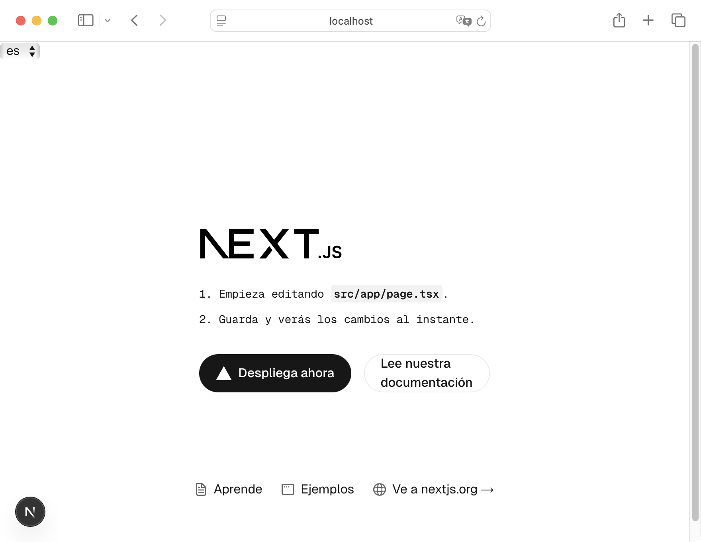

# Lingo.dev Compiler 💚 Next.js

This is a [Next.js](https://nextjs.org) project bootstrapped with [`create-next-app`](https://nextjs.org/docs/app/api-reference/cli/create-next-app).

It implements [Lingo.dev Compiler](https://lingo.dev/en/compiler) to localize the project.

Lingo.dev Compiler docs for Next.js implementation: https://lingo.dev/en/compiler/frameworks/nextjs

## Setup

1. Bootstrap new Next.js app:

   ```sh
   $ npx create-next-app@latest
   Need to install the following packages:
   create-next-app@15.3.3
   Ok to proceed? (y)

   ✔ What is your project named? … nextjs-compiler-demo
   ✔ Would you like to use TypeScript? … Yes
   ✔ Would you like to use ESLint? … Yes
   ✔ Would you like to use Tailwind CSS? … Yes
   ✔ Would you like your code inside a `src/` directory? … Yes
   ✔ Would you like to use App Router? (recommended) … Yes
   ✔ Would you like to use Turbopack for `next dev`? … No
   ✔ Would you like to customize the import alias (`@/*` by default)? … No
   Creating a new Next.js app in /Users/m/work/nextjs-compiler-demo.
   ```

2. Install [lingo.dev](https://github.com/lingodotdev/lingo.dev/) dependency:

   ```sh
   $ npm add lingo.dev
   ```

3. Configure Lingo.dev Compiler - update `next.config.js` file

   ```tsx
   import type { NextConfig } from "next";
   import lingo from "lingo.dev/compiler";

   const nextConfig: NextConfig = {
     /* Next.js config options here */
   };

   export default lingo.next({
     sourceLocale: "en",
     targetLocales: ["es", "fr", "de"],
     models: {
       "*:*": "groq:mistral-saba-24b",
       "*:es": "meta-llama/llama-4-maverick-17b-128e-instruct",
     },
   })(nextConfig);
   ```

   This example uses [suggested Groq model](https://lingo.dev/en/compiler/configuration/advanced#suggested-groq-models) because [Groq](https://groq.com/) is fast. You can use any of the [supported LLM providers](https://lingo.dev/en/compiler/how-it-works#llm-providers).

4. Update `src/layout.tsx`:

   a. Add import on top of the file

   ```tsx
   import { LingoProvider, loadDictionary } from "lingo.dev/react/rsc";
   ```

   b. Wrap the `<html>` element in `RootLayout` component with `LingoProvider`

   ```tsx
   export default function RootLayout({
     children,
   }: Readonly<{
     children: React.ReactNode;
   }>) {
     return (
       <LingoProvider loadDictionary={(locale) => loadDictionary(locale)}>
         <html lang="en">
           <body
             className={`${geistSans.variable} ${geistMono.variable} antialiased`}
           >
             {children}
           </body>
         </html>
       </LingoProvider>
     );
   }
   ```

5. Add `LocaleSwitcher` component to your app (eg. to `src/layout.tsx`) to change your app language:

   a. Import on top of the file

   ```tsx
   import { LocaleSwitcher } from "lingo.dev/react/client";
   ```

   b. Add the component in `RootLayout` component and specify available locales:

   ```tsx
   <LocaleSwitcher locales={["en", "es", "fr", "de"]} />
   ```

6. Setup [Groq LLM provider](https://groq.com/) since it was configured (see step 3. above).

   ```sh
   $ export GROQ_API_KEY=***
   ```

   You need to create [Groq](https://groq.com/) account to obtain the API key. You might need to confirm your email address and accept Groq terms before you are able to use their API.

   Alternatively you can use any of the [supported LLM providers](https://lingo.dev/en/compiler/how-it-works#llm-providers).

7. Run `npm run dev` in your terminal

   Terminal shows output related to Next.js and Lingo.dev Compiler:

   ```sh
   $ npm run dev

   > nextjs-compiler-demo@0.1.0 dev /Users/m/work/nextjs-compiler-demo
   > next dev

     ▲ Next.js 15.3.3
     - Local:        http://localhost:3000
     - Network:      http://172.22.77.132:3000

   ✓ Starting...
   ℹ️  Starting Lingo.dev compiler...


   🔑  LLM API keys detected for configured providers: groq.
   ✨
   ```

8. Open http://localhost:3000

   Browser displays default Next.js page with an unstyled `<select>` to change language in top left:

   
